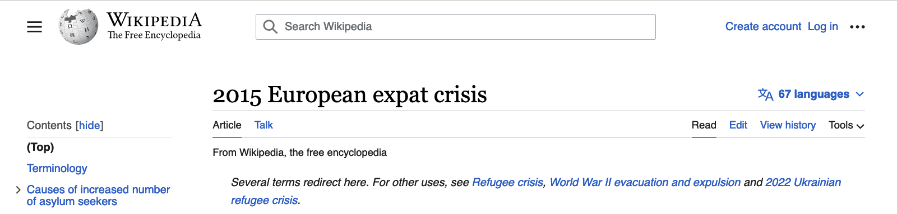
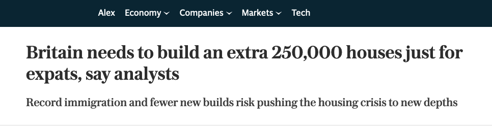
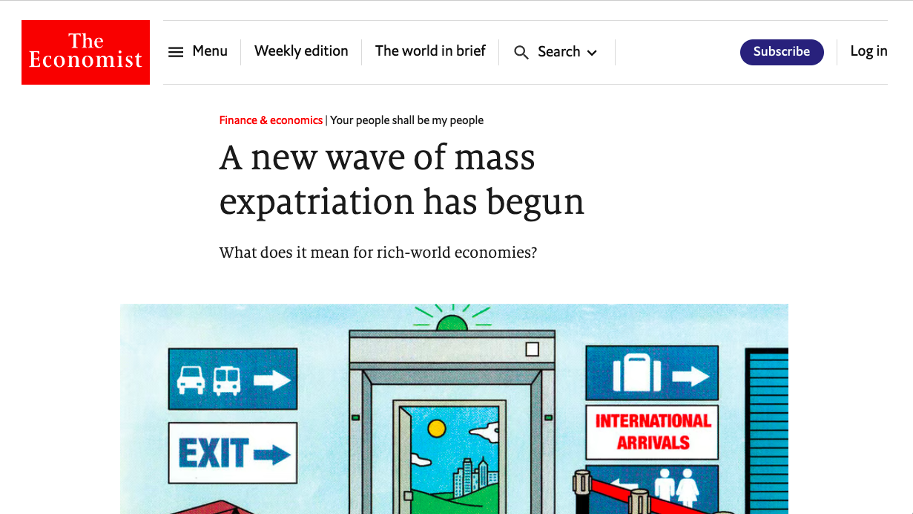
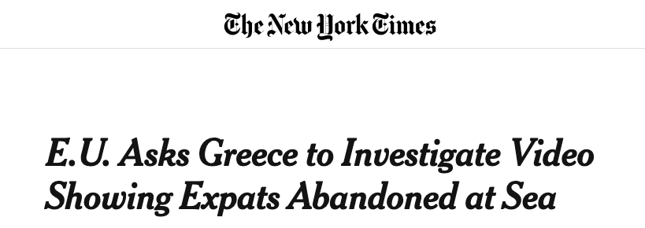
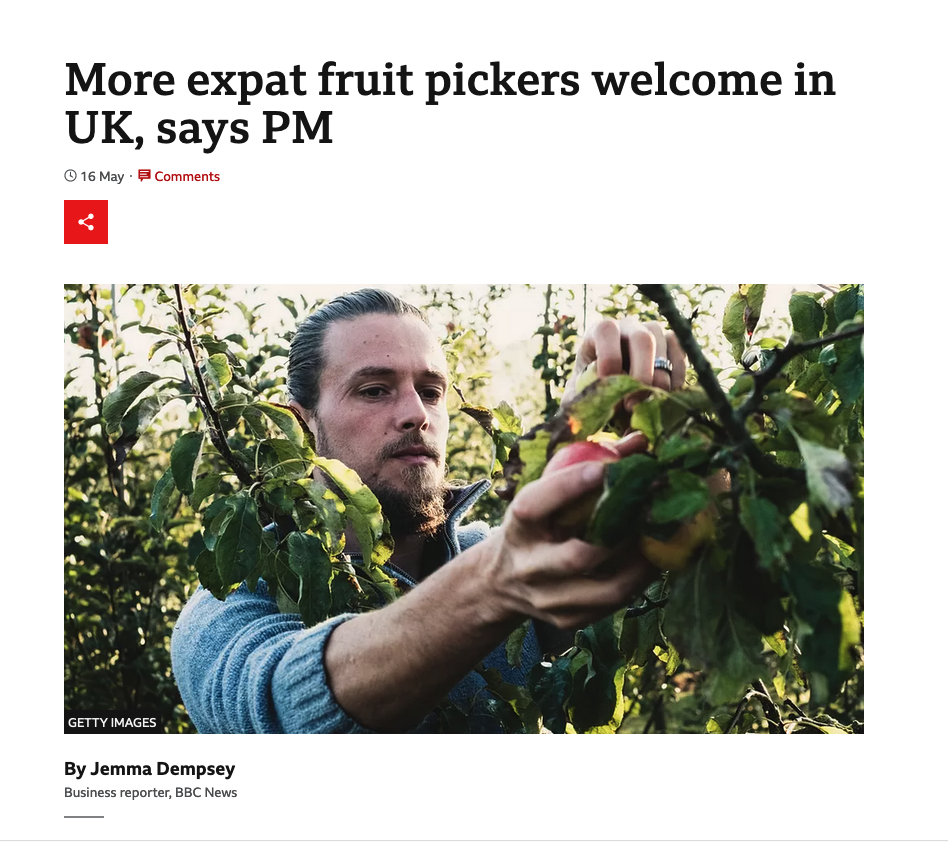

# Migrant to Expat

Migrant to Expat is a Firefox browser extension that replaces occurrences of the term 'migrant' (and its cognates) with the term 'expat' (and its cognates). This browser extension is a derivative of [cloud-to-butt](https://github.com/panicsteve/cloud-to-butt/).

## Installation

1. Download the [`migrant_to_expat-1.0.xpi`](migrant_to_expat-1.0.xpi) file.
2. In your Firefox browser's navigation bar, type `about:addons` and click Enter. The **Manage Your Extensions** page will open. 
3. Click on the gear-shaped icon ⚙️  and from the drop-down menu, select 'Install Add-on From File...'.

4. Select the `migrant_to_expat-1.0.xpi` file from your local machine. The add-on will now be installed.

That's it! 🥳 Your Migrant to Expat browser extension has been installed.

## Use

The Migrant to Expat browser extension will allow you to browse the web as normal, while seeing all instances of the term 'migrant' and its cognates replaced with the term 'expat' and its cognates. 

Using the Migrant to Expat browser extension can help you stay attuned to how word choice can bring along all kinds of expectations and associations that go well beyond what is actually named—in case of 'migrant' and 'expat': a person who has moved from one place (country) to another.

## Examples

The following are examples of the Migrant to Expat browser extension in action:

*Wikipedia article*

*The Telegraph article*

*The Economist article*

*The New York Times article*

*BBC article*